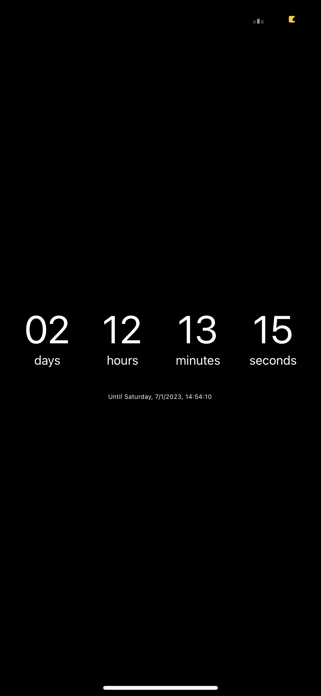

# Countdown Timer

## Description

This is a simple countdown timer that who is used to count down the time untin every Monday at 5:00 PM, every Thursday at 2:37 AM and every Saturday at 2:54 PM.

## Installation

To install this project, you need to have [Node.js](https://nodejs.org/en/) installed on your computer.

Then, you need to install the dependencies with the following command:

```bash
npm install
```


## Usage

To run this project, you need to run the following command:

```bash
npm start
```

## Image

There is only one image for this project:

